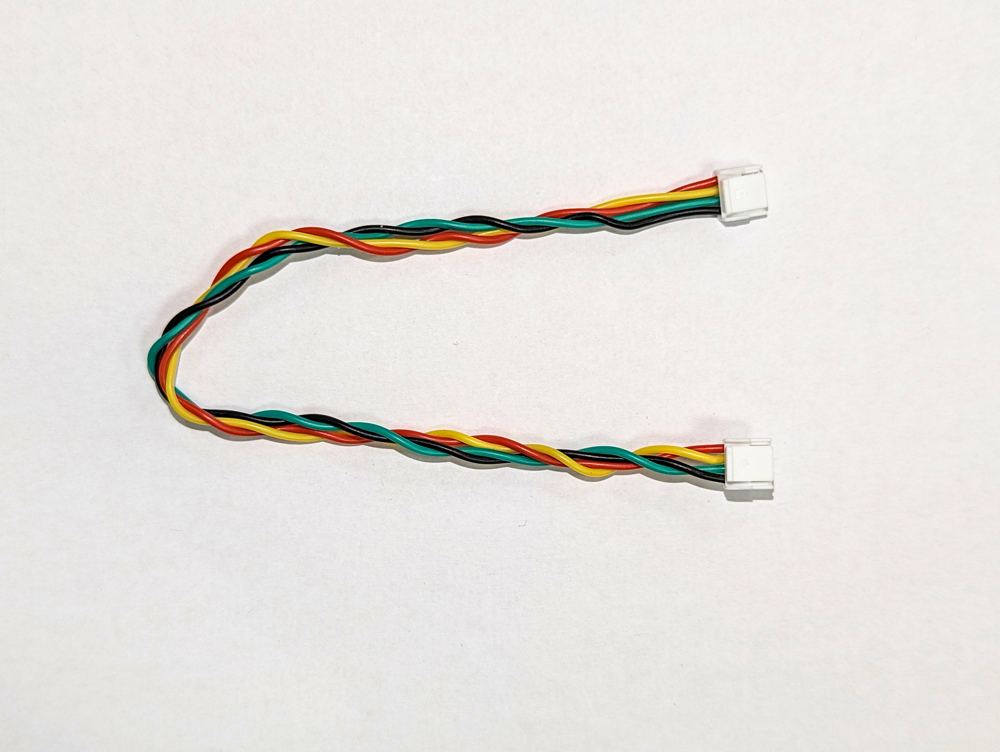
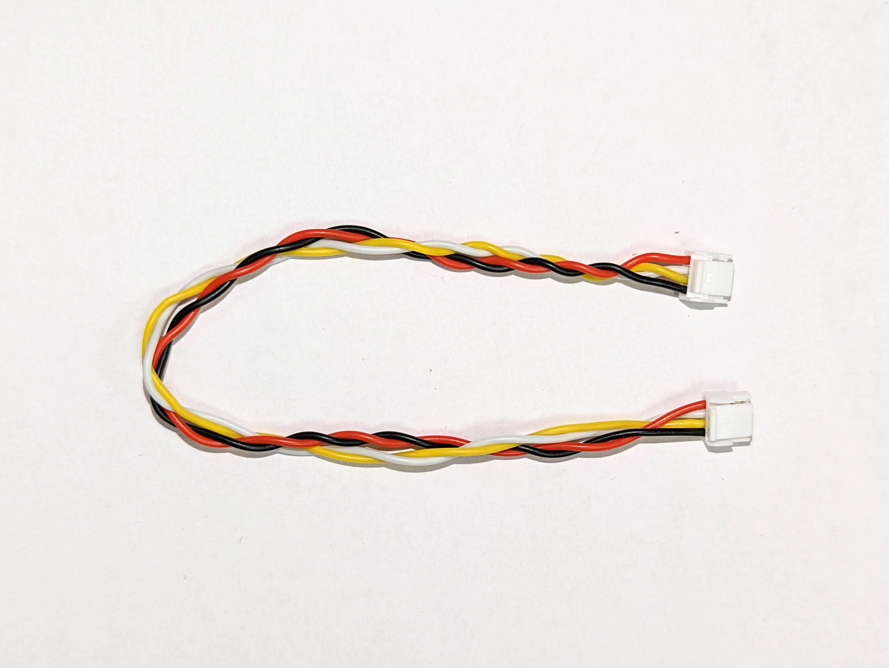

# TFCAB01 - Thunderfly Pixhaw compatible cabling system

TFCABxxyy01 are silicone cables for [Pixhawk](https://pixhawk.org/) based drones. The cables are from the both sides equipped with JST-GH high-streght plastic clips. Cables are designed and manufactured to have increased restistance to electromagnetic interference and self cross-talk.

## Where I can buy them?

Cables can be purchased online from Thunderfly Tindie store. Links to individual variants can be found in the following list.

## List of ThunderFly cables

 * TFCAB15I2C01 (I2C, 15cm)
 * TFCAB30I2C01 (I2C, 30cm)
 * TFCAB45I2C01 (I2C, 45cm)
 * TFCAB15CAN01 (CAN, 15cm)
 * TFCAB30CAN01 (CAN, 30cm)
 * TFCAB45CAN01 (CAN, 45cm)

### Wires

 * Insulation: Silicone, high temperature resistant (up to 200 °C)
 * Wire outer diameter: 1mm
 * Conductor: 26 AWG;  20/0.08, Sn plated Cu
 * Wire ending: JST-GH

## Color scheme

For easy orientation in avionics cabling cables we have designed a  ThunderFly color scheme.  The each type of signal/cable has own color combination, which is common in all our equipment.

## I2C

|Signal | Pixhawk Color | ThunderFly color |
|--------|------------------|---------------------|
| +5V  | Red             |    Red                   |
| SCL  | Black          |   Yellow                |
| SDA  | Black          |   Green                |
| GND | Black          |  Black                 |

#### Cable twisting

- 10 turns for each pair  SCL/+5V and SDA/GND per 30cm cable length
- 4 turns of both pairs together per 30cm cable length.

## UAVCAN

|Signal | Pixhawk Color | ThunderFly color |
|--------|------------------|---------------------|
| +5V  |        Red       |  Red                 |
| CAN_H  |  Black     |  White              |
| CAN_L |    Black     |  Yellow             |
| GND |        Black    |  Black               |

#### Cable twisting
- 10 turns for each pair GND/+5V and CAN_L/CAN_H per 30cm cable length
- 4 turns of both pairs together per 30cm cable length.
